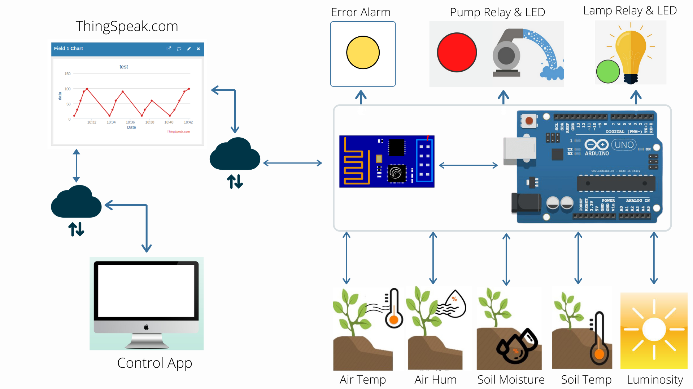

# Smart Agro System

* "Smart Agro System" is an IoT and Arduino based project that can be used in the agriculture sector to enhance crop productivity in a natural way.

* The system consists of sensors (temperature and humidity sensors both for air and soil separately, luminosity sensor) which are installed in the agricultural land.

* The data collected from those sensors is sent to the cloud (ThingSpeak.com) using the Wi-Fi module connected to the Arduino Uno development board.

* The data present on the cloud is fetched by the remote user using the ThingSpeak platform.

* The fetched data is analyzed and then the necessary decisions are taken such as commanding remote actuators (electrical Pump and electrical Lamp) which are installed in the agricultural land.

